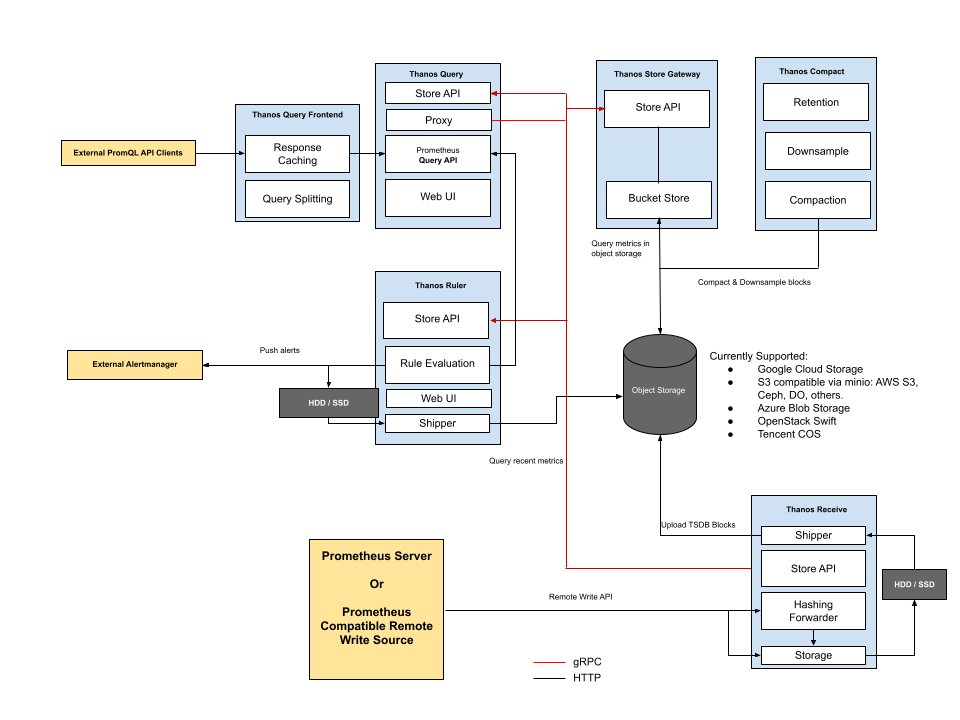

## Thanos Example

### Architecture

[Sidecar Mode](./sidecar) | [Receive Mode](./receiver)
-----|------
 | 

### Components

Component | Description
----|------
Sidecar | The thanos sidecar command runs a component that gets deployed along with a Prometheus instance. This allows sidecar to optionally upload metrics to object storage and allow Queriers to query Prometheus data with common, efficient StoreAPI.
Query | The thanos query command (also known as "Querier") implements the Prometheus HTTP v1 API to query data in a Thanos cluster via PromQL.
Store Gateway | The thanos store command (also known as Store Gateway) implements the Store API on top of historical data in an object storage bucket. It acts primarily as an API gateway and therefore does not need significant amounts of local disk space. It joins a Thanos cluster on startup and advertises the data it can access. It keeps a small amount of information about all remote blocks on local disk and keeps it in sync with the bucket. This data is generally safe to delete across restarts at the cost of increased startup times.
Compactor | The thanos compact command applies the compaction procedure of the Prometheus 2.0 storage engine to block data stored in object storage. It is generally not semantically concurrency safe and must be deployed as a singleton against a bucket.
Rule | The thanos rule command evaluates Prometheus recording and alerting rules against chosen query API via repeated --query (or FileSD via --query.sd). If more than one query is passed, round robin balancing is performed.
Receiver | The thanos receive command implements the Prometheus Remote Write API. It builds on top of existing Prometheus TSDB and retains their usefulness while extending their functionality with long-term-storage, horizontal scalability, and downsampling. It exposes the StoreAPI so that Thanos Queriers can query received metrics in real-time. The Thanos Sidecar is not sufficient for this, as the system would always lag the block length behind (typically 2 hours).

### Reference

- [OpenShift Container Platform monitoring stack](https://docs.openshift.com/container-platform/4.10/monitoring/monitoring-overview.html)
- [Introducing Thanos: Prometheus at scale](https://www.improbable.io/blog/thanos-prometheus-at-scale)
- [Thanos Querier Versus Thanos Querier](https://cloud.redhat.com/blog/thanos-querier-versus-thanos-querier)